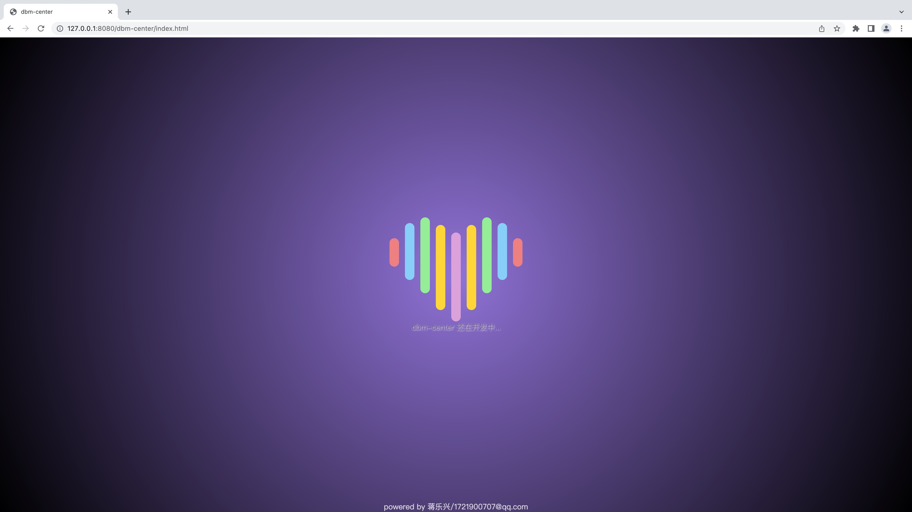

## 安装
```bash
pip3 install dbm-center
```

---


## 启动
验证环境可以这样简单的启动
```bash
dbm-center runserver 8080

Django version 4.1.2, using settings 'dbmcenter.settings'
Starting development server at http://127.0.0.1:8080/
Quit the server with CONTROL-C.
```

---

## 效果




---
